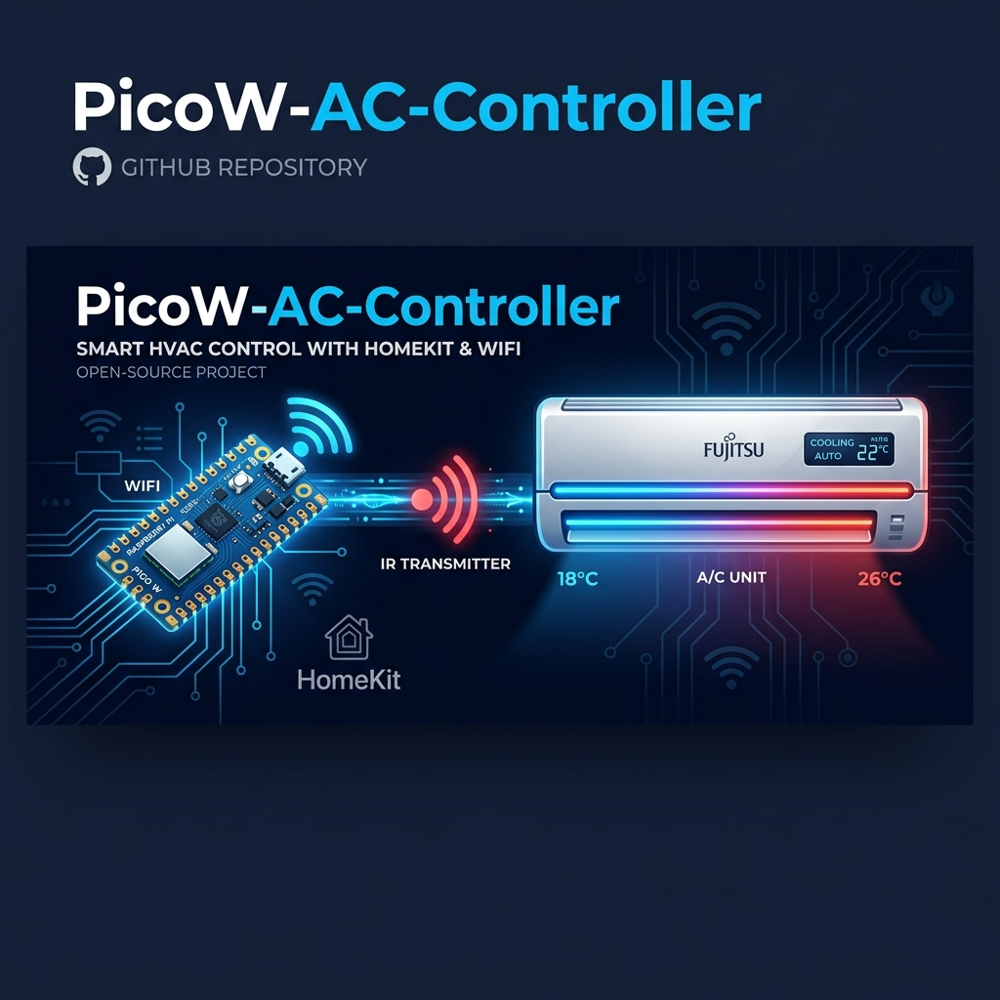
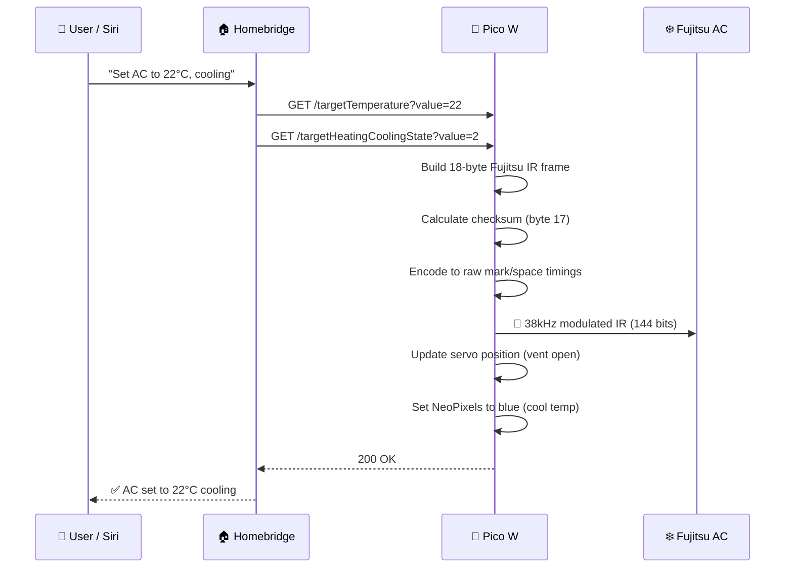
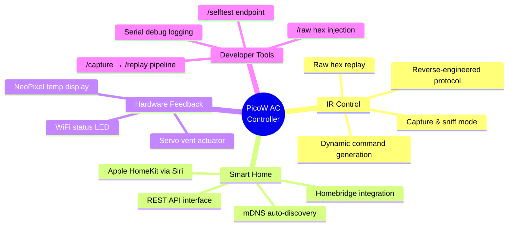
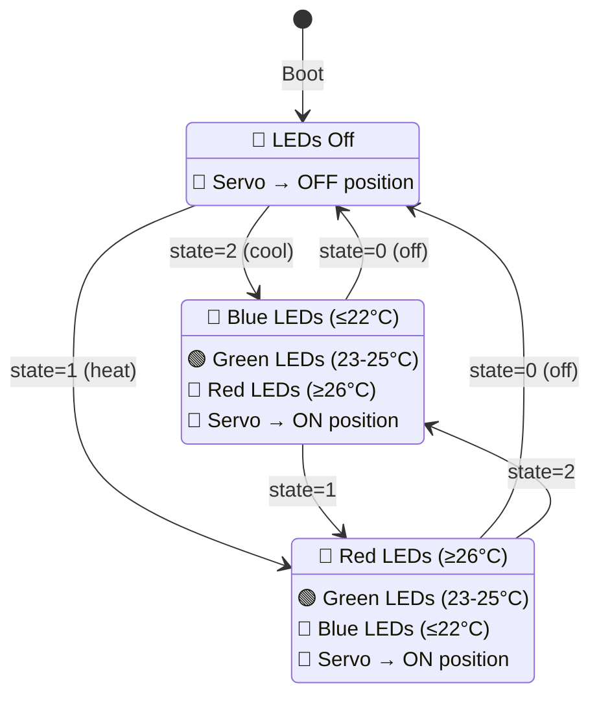

<p align="center">
  
</p>

<h1 align="center">❄️ PicoW-AC-Controller</h1>

<p align="center">
  <strong>Smart AC control via reverse-engineered Fujitsu IR protocol — with Apple HomeKit integration</strong>
</p>

<p align="center">
  
  
  
  
</p>

<p align="center">
  
  
  
  
</p>

---

## 📖 Overview

**PicoW-AC-Controller** transforms a **$6 Raspberry Pi Pico W** into a fully functional smart AC controller for **Fujitsu split-system air conditioners**. It replaces the original remote control by generating bit-perfect IR commands using a **reverse-engineered 144-bit Fujitsu protocol** — then exposes the AC unit to **Apple HomeKit** via Homebridge, enabling voice control through Siri.

### ✨ The Problem It Solves

Traditional wall-mount AC units ship with infrared remotes that can't be integrated into smart home ecosystems. Commercial smart IR blasters cost $30–$60 and use proprietary clouds. This project achieves the same result with:

- **$6 in hardware** (Pico W + IR LED + transistor)
- **Zero cloud dependency** — everything runs on your local network
- **Full protocol control** — not just replay, but dynamic command generation
- **Physical hardware feedback** — servo-actuated vent + color-coded LED status

---

## 🏗️ System Architecture

```
┌──────────────────────────────────────────────────────────────────────────────┐
│                           SYSTEM OVERVIEW                                    │
└──────────────────────────────────────────────────────────────────────────────┘

  ┌────────────────┐    HTTP REST API     ┌─────────────────────┐
  │   Homebridge   │ ◄──────────────────► │                     │
  │   (Mac/RPi)    │   WebThermostat      │   Raspberry Pi      │    ┌──────────┐
  │                │   Plugin             │   Pico W             │    │ Fujitsu  │
  └────────┬───────┘                      │                     │    │ AS-A289H │
           │                              │  ┌───────────────┐  │    │ AC Unit  │
  ┌────────┴───────┐                      │  │ IR Protocol   │  │    │          │
  │  Apple Home /  │    mDNS Discovery    │  │ Engine        │──│──► │  [IR RX] │
  │  Siri          │    fujitsu-ac.local  │  │ (144-bit      │  │    │          │
  │  "Set AC to    │                      │  │  Fujitsu)     │  │    └──────────┘
  │   22 degrees"  │                      │  └───────────────┘  │
  └────────────────┘                      │                     │
                                          │  ┌───────────────┐  │    ┌──────────┐
                                          │  │ Servo Motor   │──│──► │ Vent     │
                                          │  │ (PWM control) │  │    │ Actuator │
                                          │  └───────────────┘  │    └──────────┘
                                          │                     │
                                          │  ┌───────────────┐  │    ┌──────────┐
                                          │  │ NeoPixel LEDs │──│──► │ Status   │
                                          │  │ (temp color)  │  │    │ Display  │
                                          │  └───────────────┘  │    └──────────┘
                                          │                     │
                                          │  ┌───────────────┐  │
                                          │  │ IR Receiver   │◄─│─── [Remote sniff]
                                          │  │ (capture mode)│  │
                                          │  └───────────────┘  │
                                          └─────────────────────┘
```

### 🔄 Request Flow



### 🔌 IR Signal Capture & Replay Pipeline


---

## 🔬 Reverse-Engineered IR Protocol

A key technical achievement of this project is the **complete reverse-engineering of the Fujitsu AR-RFL5J remote protocol**. The protocol was decoded by capturing raw IR timings from the original remote and analyzing the bit patterns.

> 📄 Full protocol specification: [`FUJITSU_IR_PROTOCOL.md`](FUJITSU_IR_PROTOCOL.md)

### Protocol Summary

| Feature | Short Code (OFF) | Long Code (ON/Settings) |
|---------|:-----------------:|:-----------------------:|
| **Length** | 7 bytes (56 bits) | 18 bytes (144 bits) |
| **Carrier** | 38 kHz | 38 kHz |
| **Bit Order** | LSB first | LSB first |
| **Header** | 3324µs mark + 1574µs space | 3324µs mark + 1574µs space |
| **Bit 1** | 448µs mark + 1182µs space | 448µs mark + 1182µs space |
| **Bit 0** | 448µs mark + 390µs space | 448µs mark + 390µs space |
| **Checksum** | Byte complement (~CMD) | Modular sum (bytes 7–16) |

### 18-Byte Frame Structure

```
┌──────────────────────┬────────────┬────────────────────────────────┐
│   Header (fixed)     │  Control   │         Payload                │
├──────┬──────┬────────┤            ├──────┬──────┬───────┬──────────┤
│ MFG  │ DEV  │ FIXED  │  0xFE 0x0B │ PWR  │ TEMP │ MODE  │ CHECKSUM │
│14 63 │  00  │ 10 10  │            │  41  │  ··  │  ··   │   ··     │
├──────┴──────┴────────┴────────────┴──────┴──────┴───────┴──────────┤
│ Byte: 0  1    2   3  4    5    6     7     8      9    10-16   17  │
└───────────────────────────────────────────────────────────────────-┘
```

### Temperature Encoding Formula

```
byte8 = ((temp_celsius - 8) / 2) << 4 | 0x01
```

| Temperature | Encoded Byte |
|:-----------:|:------------:|
| 18°C | `0x51` |
| 20°C | `0x61` |
| 22°C | `0x71` |
| 24°C | `0x81` |
| 26°C | `0x91` |
| 28°C | `0xA1` |
| 30°C | `0xB1` |

---

## 🧩 Feature Overview



---

## 🔧 Hardware

### Bill of Materials

| Component | Specification | Qty | Est. Cost |
|-----------|--------------|:---:|:---------:|
| **Raspberry Pi Pico W** | RP2040, Dual-core ARM Cortex-M0+, WiFi 4 | 1 | ~$6 |
| **IR LED** | 940nm, 5mm, with NPN transistor driver (2N2222 + 100Ω) | 1 | ~$0.50 |
| **IR Receiver** | VS1838B / TSOP4838 (38kHz) | 1 | ~$0.50 |
| **Servo Motor** | SG90 micro servo (vent actuator) | 1 | ~$2 |
| **WS2812B NeoPixel Strip** | 8 LEDs, 5V, addressable RGB | 1 | ~$1 |
| | | **Total** | **~$10** |

### 📐 Wiring Diagram

```
                      Raspberry Pi Pico W
                     ┌─────────────────────┐
                     │                     │
     [5V PSU] ───────┤ VBUS          GND  ├────── [Common GND]
                     │                     │
                     │ GP16 (LED_PIN)     ├──────► [WS2812B Data In]
                     │                     │
                     │ GP13 (SERVO_PIN)   ├──────► [SG90 Signal (Orange)]
                     │                     │
                     │ GP15 (IR_SEND)     ├──┐
                     │                     │  │    ┌─────────────────┐
                     │                     │  └───►│ 100Ω → 2N2222  │
                     │                     │       │ Base            │
                     │                     │       │ Collector ──► IR LED → 5V
                     │                     │       │ Emitter ──► GND │
                     │                     │       └─────────────────┘
                     │ GP3 (IR_RECV)      ├◄───── [VS1838B Signal]
                     │                     │
                     │ LED_BUILTIN        ├──────► [WiFi Status]
                     │                     │
                     └─────────────────────┘

     ⚠️  IR LED MUST use transistor driver for room-distance operation
     ⚠️  Common ground between Pico, servo, LEDs, and IR LED circuit
```

---

## 🌐 REST API Reference

The Pico W exposes an HTTP server compatible with Homebridge's [WebThermostat](https://github.com/AirIcing/homebridge-web-thermostat) plugin:

| Endpoint | Method | Description | Example |
|----------|--------|-------------|---------|
| `/` or `/status` | `GET` | Returns current AC state as JSON | → `{"targetHeatingCoolingState":2, "targetTemperature":24.0, ...}` |
| `/targetTemperature` | `GET` | Set target temperature | `?value=22` |
| `/targetHeatingCoolingState` | `GET` | Set mode (0=off, 1=heat, 2=cool) | `?value=2` |
| `/selftest` | `GET` | Send a known-good IR command | `?cmd=cool_on` or `?cmd=off` |
| `/raw` | `GET` | Send arbitrary hex bytes as IR | `?hex=14630010100202FD` |
| `/capture` | `GET` | Arm IR receiver for signal capture | — |
| `/replay` | `GET` | Replay last captured IR signal | — |
| `/captured` | `GET` | View raw timings + decoded hex of last capture | — |

### Homebridge Configuration

```json
{
    "accessories": [
        {
            "accessory": "WebThermostat",
            "name": "Fujitsu AC",
            "apiroute": "http://fujitsu-ac.local",
            "temperatureDisplayUnits": 0,
            "maxTemp": 30,
            "minTemp": 18
        }
    ]
}
```

---

## 🚀 Getting Started

### Prerequisites

- [Arduino IDE 2.x](https://www.arduino.cc/en/software)
- **Board Package:** [Raspberry Pi Pico / RP2040](https://github.com/earlephilhower/arduino-pico) by Earle Philhower
- **Libraries** (install via Library Manager):

| Library | Purpose |
|---------|---------|
| [`Adafruit NeoPixel`](https://github.com/adafruit/Adafruit_NeoPixel) | WS2812B LED control |
| [`IRremote`](https://github.com/Arduino-IRremote/Arduino-IRremote) | IR send/receive (v4.x) |
| [`RP2040_PWM`](https://github.com/khoih-prog/RP2040_PWM) | Hardware PWM for servo |
| [`LEAmDNS`](https://github.com/earlephilhower/arduino-pico) | mDNS discovery (built-in) |

### Installation

```bash
# 1. Clone the repository
git clone https://github.com/YOUR_USERNAME/PicoW-AC-Controller.git

# 2. Open in Arduino IDE
#    File → Open → PicoW-AC-Controller.ino
```

### Configuration

1. Create your local configuration by copying or renaming `config.h`:

```cpp
// config.h — Edit these values for your setup

// WiFi Credentials
const char* WIFI_SSID     = "YOUR_WIFI_SSID";
const char* WIFI_PASSWORD = "YOUR_WIFI_PASSWORD";

// Hardware Pin Mapping
#define LED_PIN           16    // GP16 → WS2812B data
#define NUM_LEDS          8     // Number of status LEDs
#define SERVO_PIN         13    // GP13 → SG90 servo signal
#define IR_SEND_PIN       15    // GP15 → IR LED (via transistor)
#define IR_RECV_PIN       3     // GP3  → VS1838B IR receiver

// Servo Calibration (adjust for your vent mechanism)
#define SERVO_ON_DUTY     10.8  // Duty cycle when AC is ON
#define SERVO_OFF_DUTY    4.2   // Duty cycle when AC is OFF
```

### Flash & Run

1. **Select Board:** `Raspberry Pi Pico W` in Arduino IDE
2. **Upload** the sketch via USB
3. **Verify** — open Serial Monitor at 115200 baud
4. **Test** — navigate to `http://fujitsu-ac.local/selftest` in your browser
5. **Configure Homebridge** — add the WebThermostat accessory (see config above)

---

## 🧠 Technical Deep Dive

### IR Transmission Strategy

The RP2040 requires special handling for long IR signals. Direct pulse-distance encoding fails for 144-bit frames due to timing jitter. This project uses a **pre-built raw timing array** approach:

```
1. Build array:  [HDR_MARK, HDR_SPACE, BIT_MARK, BIT_SPACE, ..., STOP_MARK]
2. Disable interrupts:  Stop IR receiver + servo PWM
3. Transmit:  IrSender.sendRaw(buffer, length, 38kHz)
4. Restore:  Re-enable receiver + servo
```

This achieves **bit-perfect transmission** verified against the original remote's output.

### Hardware Feedback System



### Key Design Decisions

| Decision | Rationale |
|----------|-----------|
| **Pico W over ESP32** | Dual-core M0+ provides stable IR timing; dedicated core for WiFi prevents jitter |
| **Manual mark/space encoding** | `sendPulseDistanceWidthFromArray()` unreliable on RP2040 for 144-bit signals |
| **IR receiver stop during TX** | Eliminates self-interference that corrupts transmitted signals |
| **Servo PWM stop during TX** | RP2040 PWM interrupt at 50Hz disrupts IR timing precision |
| **Smooth servo movement** | 0.1% duty cycle steps every 20ms prevents mechanical shock to vent |
| **mDNS naming** | `fujitsu-ac.local` eliminates need for static IP configuration |
| **WebThermostat protocol** | HTTP-based Homebridge plugin — simpler than implementing full HAP on RP2040 |

### Developer Tooling

The firmware includes a complete IR development toolkit accessible via HTTP:

```
📡 CAPTURE PIPELINE:
     GET /capture  →  Arms receiver, waits for remote button press
     GET /captured →  Displays raw timings + decoded hex bytes
     GET /replay   →  Re-transmits the captured signal

🔬 DEBUG ENDPOINTS:
     GET /selftest?cmd=cool_on  →  Sends known-good 18-byte Cool ON frame
     GET /selftest?cmd=off      →  Sends known-good 7-byte Power OFF frame
     GET /raw?hex=146300...     →  Inject arbitrary hex bytes for protocol testing
```

This toolkit was used to reverse-engineer the entire Fujitsu protocol documented in [`FUJITSU_IR_PROTOCOL.md`](FUJITSU_IR_PROTOCOL.md).

---

## 📁 Project Structure

```
PicoW-AC-Controller/
├── PicoW-AC-Controller.ino    # Main firmware (WiFi, web server, IR engine, hardware control)
├── config.h                    # User-configurable WiFi, pins, and servo calibration
├── FUJITSU_IR_PROTOCOL.md      # Complete reverse-engineered IR protocol reference
├── homebridge-config.json      # Example Homebridge WebThermostat configuration
├── docs/
│   └── images/
│       └── banner.png          # README banner image
└── README.md                   # You are here
```

---

## 🗺️ Roadmap

- [ ] **Multiple AC Unit Support** — Address different Fujitsu device IDs (A/B/C/D) from one controller
- [ ] **Fan Speed Control** — Decode bytes 15–16 for fan and swing direction settings
- [ ] **Temperature Sensor** — Add DHT22/BME280 for actual room temperature feedback to HomeKit
- [ ] **OTA Updates** — Flash firmware wirelessly via HTTP upload endpoint
- [ ] **Web Dashboard** — Real-time status page with temperature history graphs
- [ ] **MQTT Integration** — Publish state to Home Assistant / Node-RED
- [ ] **Fahrenheit Support** — Enable bit 1 of byte 8 for US temperature units
- [ ] **Schedule System** — On-device timer/schedule without Homebridge dependency

---

## 🧪 Related Projects

This controller is part of a larger **Hyperion Integration** ecosystem:

| Project | Platform | Description |
|---------|----------|-------------|
| **PicoW-AC-Controller** *(this)* | Pico W (RP2040) | IR-based Fujitsu AC control + Homebridge |
| [**HyperionESP32C3**](../HyperionESP32C3/) | ESP32-C3 | Ambient TV backlighting + HomeKit (dual-mode) |
| [**ESP32-AC-Controller**](../ESP32-AC-Controller/) | ESP32-C3 | Native HomeKit AC control via HomeSpan |

---

## 🤝 Contributing

Contributions are welcome! This project especially benefits from:

- 🔍 **Additional Fujitsu remote captures** — help decode fan/swing bytes
- 🧪 **Testing with other Fujitsu models** — verify protocol compatibility
- 📡 **Alternative IR hardware** — longer-range transmitter circuits

```bash
# Fork → Branch → Commit → PR
git checkout -b feature/your-feature
git commit -m "Add your feature"
git push origin feature/your-feature
```

---

## 📜 License

This project is licensed under the MIT License — see the [LICENSE](LICENSE) file for details.

---

## 🙏 Acknowledgments

- [**IRremote**](https://github.com/Arduino-IRremote/Arduino-IRremote) — Versatile IR library by Armin Joachimsmeyer
- [**Adafruit NeoPixel**](https://github.com/adafruit/Adafruit_NeoPixel) — Industry-standard addressable LED library
- [**RP2040_PWM**](https://github.com/khoih-prog/RP2040_PWM) — Hardware PWM for RP2040 by Khoi Hoang
- [**Homebridge**](https://homebridge.io/) — HomeKit bridge for non-native accessories
- [**IRremoteESP8266**](https://github.com/crankyoldgit/IRremoteESP8266) — Fujitsu IR timing constants reference

---

<p align="center">
  <sub>Built with ⚡ on Raspberry Pi Pico W · Controlled by 🏠 HomeKit · Reverse-engineered from 📡 Fujitsu AR-RFL5J</sub>
</p>
