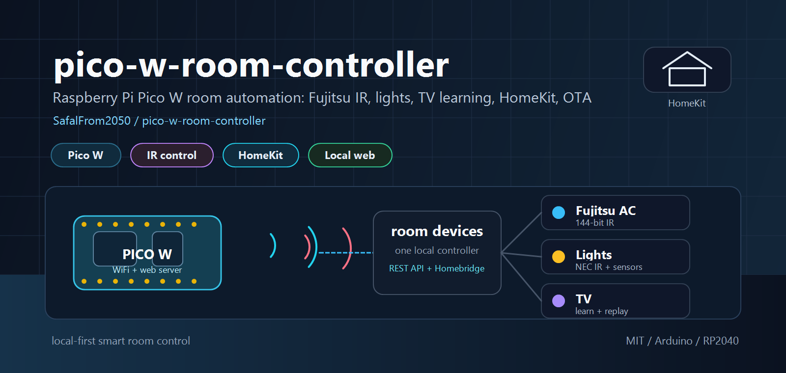
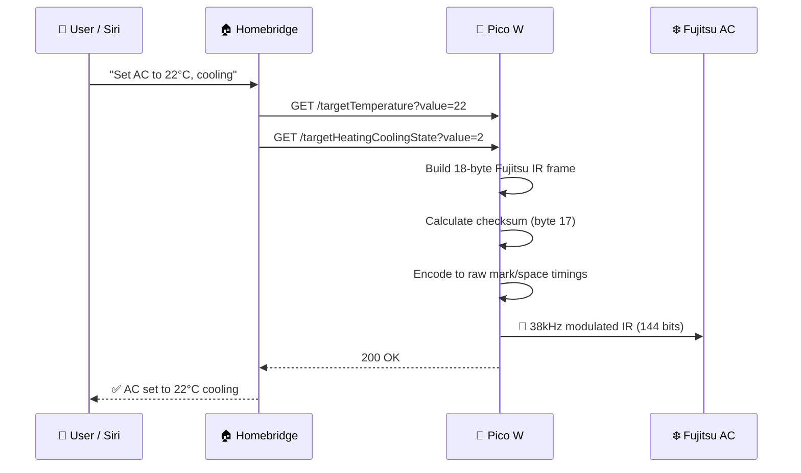
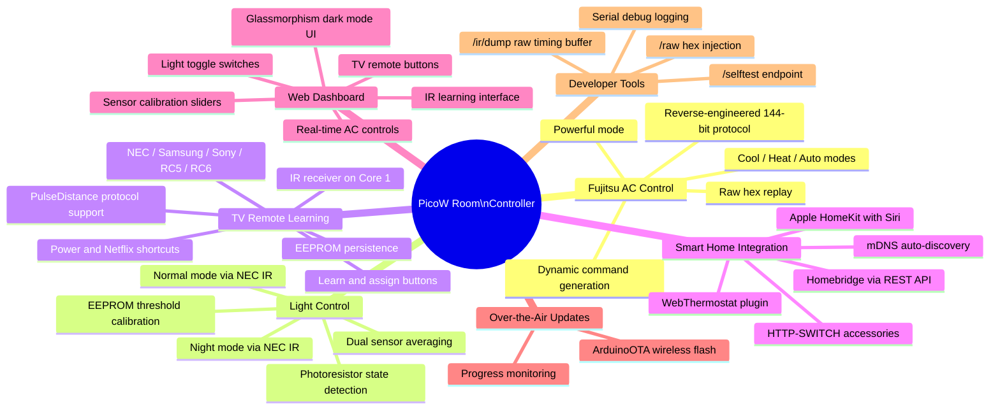
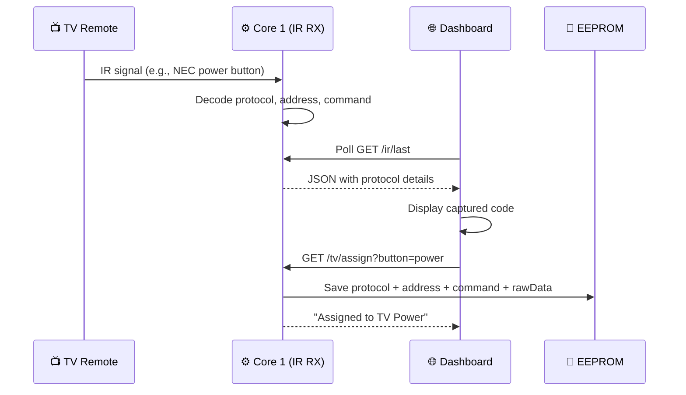

<p align="center">
  
</p>

<h1 align="center">pico-w-room-controller</h1>

<p align="center">
  <strong>Smart room controller powered by Raspberry Pi Pico W — Fujitsu AC (reverse-engineered IR), ceiling light control, TV remote learning, web dashboard, Apple HomeKit via Homebridge, and OTA firmware updates</strong>
</p>

<p align="center">
  
  
  
  
</p>

<p align="center">
  
  
  
  
  
  
</p>

---

## 📖 Overview

**pico-w-room-controller** turns a **$6 Raspberry Pi Pico W** into a multi-device smart room controller. Originally built to control a **Fujitsu split-system air conditioner** via a **reverse-engineered 144-bit IR protocol**, the project has grown into a full room automation hub that also controls ceiling lights, learns TV remote codes, and serves a real-time web dashboard — all accessible through **Apple HomeKit** via Homebridge.

### ✨ What It Does

| Capability | Description |
|-----------|-------------|
| **Fujitsu AC Control** | Generates bit-perfect 144-bit IR commands (cool, heat, auto, power off, powerful mode) using a fully reverse-engineered protocol |
| **Ceiling Light Control** | Toggles normal and night modes via NEC IR protocol with photoresistor-based state detection |
| **TV Remote Learning** | Captures IR codes from any TV remote (NEC, Samsung, Sony, RC5/6, PulseDistance) via an IR receiver, stores them in EEPROM, and replays on demand |
| **Web Dashboard** | Glassmorphism dark-mode dashboard served directly from the Pico W for controlling all devices from a browser |
| **Apple HomeKit** | Full integration via Homebridge (WebThermostat + HTTP-SWITCH plugins) — control everything with Siri |
| **OTA Updates** | Wireless firmware updates via ArduinoOTA after initial USB flash |
| **Dual-Core Architecture** | Core 0 handles WiFi + web server + IR transmit; Core 1 runs dedicated IR receiver to prevent timing conflicts |

### 💡 Why This Project?

Traditional wall-mount AC units and ceiling lights ship with infrared remotes that can't be integrated into smart home ecosystems. Commercial smart IR blasters cost $30–$60 and require proprietary cloud services. This project achieves the same result with:

- **~$10 in hardware** (Pico W + IR LED + IR receiver + photoresistors + transistor)
- **Zero cloud dependency** — everything runs on your local network
- **Full protocol control** — not replay-only, but dynamic command generation with checksum calculation
- **Multi-device control** — AC, lights, and TV from one microcontroller
- **Over-the-Air updates** — wireless firmware flashing after initial USB setup
- **EEPROM persistence** — settings and learned TV codes survive reboots

---

## 🏗️ System Architecture

```
┌──────────────────────────────────────────────────────────────────────────────┐
│                           SYSTEM OVERVIEW                                    │
└──────────────────────────────────────────────────────────────────────────────┘

  ┌────────────────┐    HTTP REST API     ┌─────────────────────────────────┐
  │   Homebridge   │ ◄──────────────────► │        Raspberry Pi Pico W      │
  │   (Mac/RPi)    │   WebThermostat +    │                                 │
  │                │   HTTP-SWITCH        │  Core 0:                        │
  └────────┬───────┘   Plugins            │  ┌─────────────┐ ┌───────────┐ │
           │                              │  │ WiFi + mDNS │ │ Web       │ │
  ┌────────┴───────┐                      │  │ (STA mode)  │ │ Dashboard │ │     ┌──────────┐
  │  Apple Home /  │    mDNS Discovery    │  └─────────────┘ └───────────┘ │     │ Fujitsu  │
  │  Siri          │    fujitsu-ac.local  │  ┌─────────────┐               │     │ AC Unit  │
  │  "Set AC to    │                      │  │ IR Sender   │───────────────│────►│  [IR RX] │
  │   22 degrees"  │                      │  │ (GP12/GP15) │               │     └──────────┘
  └────────────────┘                      │  └─────────────┘               │
                                          │  ┌─────────────┐               │     ┌──────────┐
  ┌────────────────┐                      │  │ ArduinoOTA  │               │     │ Ceiling  │
  │  Web Browser   │   http://fujitsu-    │  └─────────────┘               │────►│ Light    │
  │  Dashboard     │   ac.local/          │                                │     │  [IR RX] │
  └────────────────┘                      │  Core 1:                       │     └──────────┘
                                          │  ┌─────────────┐               │
                                          │  │ IR Receiver │◄──────────────│──── [TV Remote]
                                          │  │ (GP3)       │               │
                                          │  └─────────────┘               │     ┌──────────┐
                                          │                                │────►│ TV       │
                                          │  ┌─────────────┐               │     │  [IR RX] │
                                          │  │ Light       │               │     └──────────┘
                                          │  │ Sensors     │
                                          │  │ (GP27/GP28) │
                                          │  └─────────────┘
                                          │  ┌─────────────┐
                                          │  │ EEPROM      │
                                          │  │ (Settings)  │
                                          │  └─────────────┘
                                          └─────────────────────────────────┘
```

### 🔄 Request Flow



---

## 🔬 Reverse-Engineered Fujitsu IR Protocol

A key technical achievement of this project is the **complete reverse-engineering of the Fujitsu AR-RFL5J remote protocol**. The protocol was decoded by capturing raw IR timings from the original remote and analyzing the bit patterns.

> 📄 Full protocol specification: [`FUJITSU_IR_PROTOCOL.md`](FUJITSU_IR_PROTOCOL.md)

### Protocol Summary

| Feature | Short Code (OFF) | Long Code (ON/Settings) |
|---------|:-----------------:|:-----------------------:|
| **Length** | 7 bytes (56 bits) | 18 bytes (144 bits) |
| **Carrier** | 38 kHz | 38 kHz |
| **Bit Order** | LSB first | LSB first |
| **Header** | 3324µs mark + 1574µs space | 3324µs mark + 1574µs space |
| **Bit 1** | 448µs mark + 1182µs space | 448µs mark + 1182µs space |
| **Bit 0** | 448µs mark + 390µs space | 448µs mark + 390µs space |
| **Checksum** | Byte complement (~CMD) | Modular sum (bytes 7–16) |

### 18-Byte Frame Structure

```
┌──────────────────────┬────────────┬────────────────────────────────┐
│   Header (fixed)     │  Control   │         Payload                │
├──────┬──────┬────────┤            ├──────┬──────┬───────┬──────────┤
│ MFG  │ DEV  │ FIXED  │  0xFE 0x0B │ PWR  │ TEMP │ MODE  │ CHECKSUM │
│14 63 │  00  │ 10 10  │            │  41  │  ··  │  ··   │   ··     │
├──────┴──────┴────────┴────────────┴──────┴──────┴───────┴──────────┤
│ Byte: 0  1    2   3  4    5    6     7     8      9    10-16   17  │
└───────────────────────────────────────────────────────────────────-┘
```

### Temperature Encoding Formula

```
byte8 = ((temp_celsius - 8) / 2) << 4 | 0x01
```

| Temperature | Encoded Byte |
|:-----------:|:------------:|
| 18°C | `0x51` |
| 20°C | `0x61` |
| 22°C | `0x71` |
| 24°C | `0x81` |
| 26°C | `0x91` |
| 28°C | `0xA1` |
| 30°C | `0xB1` |

---

## 🧩 Feature Overview



---

## 🔧 Hardware

### Bill of Materials

| Component | Specification | Qty | Est. Cost |
|-----------|--------------|:---:|:---------:|
| **Raspberry Pi Pico W** | RP2040, Dual-core ARM Cortex-M0+, WiFi 4 | 1 | ~$6 |
| **IR LED** | 940nm, 5mm | 1 | ~$0.20 |
| **NPN Transistor** | 2N2222 (IR LED driver) | 1 | ~$0.10 |
| **Resistor** | 100Ω (transistor base) | 1 | ~$0.05 |
| **IR Receiver** | TSOP38238 or equivalent 38kHz (for TV learning) | 1 | ~$1.00 |
| **Photoresistors** | LDR light-dependent resistors (for light state detection) | 2 | ~$0.50 |
| | | **Total** | **~$8** |

### 📐 Wiring Diagram

```
                      Raspberry Pi Pico W
                     ┌─────────────────────┐
                     │                     │
     [5V PSU] ───────┤ VBUS          GND  ├────── [Common GND]
                     │                     │
                     │ GP15 (IR_SEND) *   ├──┐
                     │                     │  │    ┌─────────────────┐
                     │                     │  └───►│ 100Ω → 2N2222  │
                     │                     │       │ Base            │
                     │                     │       │ Collector ──► IR LED → 5V
                     │                     │       │ Emitter ──► GND │
                     │                     │       └─────────────────┘
                     │                     │
                     │ GP3 (IR_RECEIVE)   ├──────► [TSOP38238 OUT]
                     │                     │        (VCC → 3.3V, GND → GND)
                     │                     │
                     │ GP28 (ADC2)        ├──────► [Photoresistor L]
                     │ GP27 (ADC1)        ├──────► [Photoresistor R]
                     │                     │
                     │ LED_BUILTIN        ├──────► [WiFi Status]
                     │                     │
                     └─────────────────────┘

     * IR_SEND_PIN is configurable in config.h (default GP15)

     ⚠️  IR LED MUST use transistor driver for room-distance operation
     ⚠️  Common ground between Pico and all peripheral circuits
     ⚠️  IR receiver requires INPUT_PULLUP (enabled in firmware)
```

---

## 🖥️ Web Dashboard

The Pico W serves a built-in **glassmorphism dark-mode dashboard** directly from flash memory. Access it at `http://fujitsu-ac.local/` from any device on your network.

### Dashboard Features

| Card | Controls |
|------|----------|
| **Fujitsu A/C** | Temperature ±, mode selection (Off / Cool / Heat), Powerful mode toggle |
| **Bedroom Lights** | Normal light switch, Night light switch |
| **TV Control** | Power button, Netflix button (only active after IR learning) |
| **IR Receiver** | Live display of captured IR codes, assign to TV Power or Netflix |
| **Sensor Calibration** | Live ADC readings (L/R), average display, dual threshold sliders with EEPROM save |

The dashboard auto-syncs state on load and polls the IR receiver and light sensors in real-time.

---

## 🌐 REST API Reference

The Pico W exposes a comprehensive HTTP API. All endpoints use `GET` method for Homebridge compatibility.

### AC Control

| Endpoint | Description | Parameters |
|----------|-------------|------------|
| `/status` | Returns current AC state as JSON | — |
| `/targetTemperature` | Set target temperature (18–30°C) | `?value=22` |
| `/targetHeatingCoolingState` | Set mode (0=off, 1=heat, 2=cool) | `?value=2` |
| `/powerful` | Toggle Powerful mode (max power 20 min) | `?value=1` or `?value=0` |
| `/powerfulStatus` | Get Powerful mode state | — |

### Light Control

| Endpoint | Description | Parameters |
|----------|-------------|------------|
| `/light/normal` | Toggle normal (full brightness) light | `?value=1` or `?value=0` |
| `/light/normalStatus` | Get normal light state | — |
| `/light/night` | Toggle night (dim warm) light | `?value=1` or `?value=0` |
| `/light/nightStatus` | Get night light state | — |
| `/light/status` | Get both light states as JSON | — |
| `/light/sensor` | Get live sensor readings (L, R, avg, thresholds, detection state) | — |
| `/light/threshold` | Set sensor thresholds (saved to EEPROM) | `?normal=350&night=100` |

### TV Control & IR Learning

| Endpoint | Description | Parameters |
|----------|-------------|------------|
| `/tv/power` | Send learned TV Power IR code | — |
| `/tv/netflix` | Send learned TV Netflix IR code | — |
| `/tv/status` | Get TV button configuration (protocol, address, command, raw) | — |
| `/tv/assign` | Assign last received IR code to a TV button | `?button=power` or `?button=netflix` |
| `/ir/last` | Get last received IR code details (JSON) | — |
| `/ir/dump` | Get raw timing buffer of last received IR signal | — |

### Debug & Testing

| Endpoint | Description | Parameters |
|----------|-------------|------------|
| `/` | Serve web dashboard | — |
| `/selftest` | Send known-good IR test command | `?cmd=cool_on` or `?cmd=off` |
| `/raw` | Send arbitrary hex bytes as IR signal | `?hex=14630010100202FD` |

### Example: Status Response

```json
{
  "targetHeatingCoolingState": 2,
  "targetTemperature": 24.0,
  "currentHeatingCoolingState": 2,
  "currentTemperature": 24.0
}
```

---

## 🏠 Homebridge Configuration

The project integrates with multiple Homebridge plugins to expose all devices to Apple HomeKit.

### Required Homebridge Plugins

| Plugin | Purpose |
|--------|---------|
| [`homebridge-web-thermostat`](https://github.com/AirIcing/homebridge-web-thermostat) | AC thermostat control (temperature + mode) |
| [`homebridge-http-switch`](https://github.com/Supereg/homebridge-http-switch) | Switches for Powerful mode, lights, and TV buttons |

### Configuration Example

```json
{
    "accessories": [
        {
            "accessory": "WebThermostat",
            "name": "Fujitsu AC",
            "apiroute": "http://fujitsu-ac.local",
            "temperatureDisplayUnits": 0,
            "maxTemp": 30,
            "minTemp": 18
        },
        {
            "accessory": "HTTP-SWITCH",
            "name": "Fujitsu Powerful",
            "switchType": "stateful",
            "onUrl": "http://fujitsu-ac.local/powerful?value=1",
            "offUrl": "http://fujitsu-ac.local/powerful?value=0",
            "statusUrl": "http://fujitsu-ac.local/powerfulStatus",
            "statusPattern": "1",
            "pullInterval": 10000
        },
        {
            "accessory": "HTTP-SWITCH",
            "name": "Normal Light",
            "switchType": "stateful",
            "onUrl": "http://fujitsu-ac.local/light/normal?value=1",
            "offUrl": "http://fujitsu-ac.local/light/normal?value=0",
            "statusUrl": "http://fujitsu-ac.local/light/normalStatus",
            "statusPattern": "1",
            "pullInterval": 10000
        },
        {
            "accessory": "HTTP-SWITCH",
            "name": "Night Light",
            "switchType": "stateful",
            "onUrl": "http://fujitsu-ac.local/light/night?value=1",
            "offUrl": "http://fujitsu-ac.local/light/night?value=0",
            "statusUrl": "http://fujitsu-ac.local/light/nightStatus",
            "statusPattern": "1",
            "pullInterval": 10000
        },
        {
            "accessory": "HTTP-SWITCH",
            "name": "TV Power",
            "switchType": "stateless",
            "onUrl": "http://fujitsu-ac.local/tv/power",
            "pullInterval": 10000
        },
        {
            "accessory": "HTTP-SWITCH",
            "name": "TV Netflix",
            "switchType": "stateless",
            "onUrl": "http://fujitsu-ac.local/tv/netflix",
            "pullInterval": 10000
        }
    ]
}
```

> 📄 A complete Homebridge configuration (including HomebridgeADB for Android TV) is available in [`homebridge-config.json`](homebridge-config.json).

---

## 🚀 Getting Started

### Prerequisites

- [Arduino IDE 2.x](https://www.arduino.cc/en/software)
- **Board Package:** [Raspberry Pi Pico / RP2040](https://github.com/earlephilhower/arduino-pico) by Earle Philhower
- **Libraries** (install via Library Manager):

| Library | Purpose |
|---------|---------|
| [`IRremote`](https://github.com/Arduino-IRremote/Arduino-IRremote) | IR send and receive (v4.x) |
| [`SimpleMDNS`](https://github.com/earlephilhower/arduino-pico) | mDNS discovery (built-in with board package) |
| [`ArduinoOTA`](https://github.com/earlephilhower/arduino-pico) | OTA updates (built-in with board package) |
| [`EEPROM`](https://github.com/earlephilhower/arduino-pico) | Persistent settings storage (built-in with board package) |

### Installation

```bash
# 1. Clone the repository
git clone https://github.com/SafalFrom2050/pico-w-room-controller.git

# 2. Open in Arduino IDE
#    File → Open → PicoW-Room-Controller.ino
```

### Configuration

Copy `config.example.h` to `config.h` and edit the values for your setup:

```cpp
// config.h — Edit these values

// WiFi Credentials
const char* WIFI_SSID     = "YOUR_WIFI_SSID";
const char* WIFI_PASSWORD = "YOUR_WIFI_PASSWORD";

// Hardware Pin Mapping
#define IR_SEND_PIN         15    // GP15 → IR LED (via transistor)
#define IR_RECEIVE_PIN       3    // GP3  → TSOP38238 IR receiver
#define LIGHT_SENSOR_PIN_L  28    // GP28 → Left photoresistor (ADC2)
#define LIGHT_SENSOR_PIN_R  27    // GP27 → Right photoresistor (ADC1)

// Light Detection Thresholds (0-1023, calibrate via dashboard)
#define LIGHT_ON_THRESHOLD    350  // Normal light detection
#define LIGHT_NIGHT_THRESHOLD 100  // Night light detection

// Fujitsu Remote Code (0=A, 1=B, 2=C, 3=D)
#define FUJITSU_CUSTOM_CODE   0

#define WEB_PORT              80
```

> **Note:** `config.h` is gitignored to protect your WiFi credentials. Only `config.example.h` is tracked.

### Flash & Run

1. **Select Board:** `Raspberry Pi Pico W` in Arduino IDE
2. **Configure Flash Size (Critical for OTA):** In **Tools > Flash Size**, select a partition layout that includes **LittleFS** (e.g., `2MB (Sketch: 1.5MB, FS: 512KB)`)
3. **Upload** the sketch via USB
4. **Verify** — open Serial Monitor at 115200 baud
5. **Test** — navigate to `http://fujitsu-ac.local/` to see the web dashboard
6. **Self-test** — visit `http://fujitsu-ac.local/selftest` to send a test IR command
7. **Configure Homebridge** — add the accessories from the configuration above
8. **Subsequent Updates (OTA):** Once running on WiFi, select the network port under **Tools > Port** and flash updates wirelessly

---

## 🧠 Technical Deep Dive

### Dual-Core Architecture

The RP2040's dual-core design is leveraged to prevent timing conflicts between IR operations:

| Core | Responsibilities |
|------|-----------------|
| **Core 0** | WiFi connection, mDNS, web server, IR transmission, ArduinoOTA, EEPROM, light sensor reading |
| **Core 1** | Dedicated IR receiver — continuously decodes incoming IR signals without being interrupted by WiFi or HTTP handling |

The IR receiver is stopped during transmission (`IrReceiver.stop()`) and restarted after (`IrReceiver.start()`) to prevent timing jitter from transmitted signals being captured as input.

### IR Transmission Strategy

The RP2040 requires special handling for long IR signals. Direct pulse-distance encoding fails for 144-bit frames due to timing jitter. This project uses a **pre-built raw timing array** approach:

```
1. Build array:  [HDR_MARK, HDR_SPACE, BIT_MARK, BIT_SPACE, ..., STOP_MARK]
2. Transmit:  IrSender.sendRaw(buffer, length, 38kHz)
```

This achieves **bit-perfect transmission** verified against the original remote's output.

### TV Remote Learning Flow



### Light State Detection

Instead of tracking state in software alone, the firmware uses **dual photoresistors** to physically detect whether the ceiling light is on. This prevents desync issues (e.g., if someone uses the physical remote). The sensor values are averaged and compared against configurable thresholds:

- **Normal threshold** (default 350): Above this = normal light is on
- **Night threshold** (default 100): Between night and normal threshold = night light is on
- Below night threshold = light is off

Thresholds are calibrated via the web dashboard sliders and persisted to EEPROM.

### Key Design Decisions

| Decision | Rationale |
|----------|-----------|
| **Pico W over ESP32** | Dual-core M0+ provides stable IR timing; dedicated core for WiFi prevents jitter |
| **Manual mark/space encoding** | `sendPulseDistanceWidthFromArray()` unreliable on RP2040 for 144-bit signals |
| **mDNS naming** | `fujitsu-ac.local` eliminates need for static IP configuration |
| **WebThermostat protocol** | HTTP-based Homebridge plugin — simpler than implementing full HAP on RP2040 |
| **ArduinoOTA updates** | Built-in OTA support uses Earle Philhower's core filesystem partition for wireless sketch updates |
| **Dual photoresistors** | Averaging two sensors reduces false positives from ambient light variation |
| **EEPROM for TV codes** | Learned TV remote codes persist across power cycles without filesystem overhead |
| **12mA GPIO drive** | `OUTPUT_12MA` on IR send pin boosts signal strength for reliable transmission |

### Developer Tooling

The firmware includes debug endpoints accessible via HTTP:

```
🔬 DEBUG ENDPOINTS:
     GET /selftest?cmd=cool_on  →  Sends known-good 18-byte Cool ON frame
     GET /selftest?cmd=off      →  Sends known-good 7-byte Power OFF frame
     GET /raw?hex=146300...     →  Inject arbitrary hex bytes for protocol testing
     GET /ir/dump               →  Dump raw timing buffer of last received IR signal
     GET /ir/last               →  JSON view of last captured IR code
```

---

## 📁 Project Structure

```
pico-w-room-controller/
├── PicoW-Room-Controller.ino  # Main firmware — WiFi, web server, IR engine, dashboard,
│                               #   light control, TV learning, OTA updates (1600+ lines)
├── config.example.h            # Template configuration (copy to config.h)
├── config.h                    # Your local config — WiFi, pins, thresholds (gitignored)
├── FUJITSU_IR_PROTOCOL.md      # Complete reverse-engineered IR protocol specification
├── homebridge-config.json      # Full Homebridge config — AC, lights, TV, Android TV
├── LICENSE                     # MIT License
├── docs/
│   └── images/
│       └── banner-clean.png    # README banner image
└── README.md                   # This file
```

---

## 🗺️ Roadmap

- [x] **Fujitsu AC Control** — Reverse-engineered 144-bit protocol with dynamic command generation
- [x] **Apple HomeKit Integration** — Full Homebridge support via WebThermostat + HTTP-SWITCH
- [x] **OTA Updates** — Flash firmware wirelessly via ArduinoOTA
- [x] **Powerful Mode** — Short code `0x39` for Fujitsu max-power burst
- [x] **Ceiling Light Control** — Normal and night modes via NEC IR with physical state detection
- [x] **TV Remote Learning** — IR receiver captures and replays TV remote codes
- [x] **Web Dashboard** — Glassmorphism dark-mode UI served from flash
- [x] **EEPROM Persistence** — Light thresholds and TV codes survive reboots
- [x] **Dual-Core Architecture** — Dedicated IR receiver on Core 1
- [ ] **Multiple AC Unit Support** — Address different Fujitsu device IDs (A/B/C/D) from one controller
- [ ] **Fan Speed Control** — Decode bytes 15–16 for fan and swing direction settings
- [ ] **Temperature Sensor** — Add DHT22/BME280 for actual room temperature feedback to HomeKit
- [ ] **Web Dashboard v2** — Temperature history graphs and schedule controls
- [ ] **MQTT Integration** — Publish state to Home Assistant / Node-RED
- [ ] **Fahrenheit Support** — Enable bit 1 of byte 8 for US temperature units
- [ ] **Schedule System** — On-device timer/schedule without Homebridge dependency


---

## 📜 License

This project is licensed under the MIT License — see the [LICENSE](LICENSE) file for details.
